# Implementation Tasks: Chapter Personalization

**Branch**: `005-chapter-personalization` | **Date**: 2025-12-23
**Spec**: [spec.md](./spec.md) | **Plan**: [plan.md](./plan.md)

## Task Organization

Tasks are organized into phases with dependencies clearly marked. Each task includes:
- **Task ID (TID)**: Unique identifier for tracking
- **Priority**: P1 (critical), P2 (important), P3 (nice-to-have)
- **User Story**: Which story this task supports (if applicable)
- **File Path**: Specific file to create/modify
- **Acceptance Criteria**: How to verify completion

## Phase 1: Setup and Dependencies

### Backend Infrastructure

- [ ] [T001] [--] [--] Create database migration for personalization_quota table (`backend/migrations/005_add_personalization_quota.sql`)
  - **Acceptance**: Migration creates table with user_id PK, request_count (0-3 constraint), first_request_timestamp, reset_at, indexes on user_id and reset_at
  - **Dependencies**: None
  - **Test**: Run migration on dev database, verify schema with `\d personalization_quota`

- [ ] [T002] [--] [--] Install OpenAI Agents SDK and markdown-it-py (`backend/requirements.txt`)
  - **Acceptance**: Added `openai-agents-python>=1.0.0`, `markdown-it-py>=3.0.0`, `mdit-py-plugins>=0.4.0`, `tenacity>=8.0.0` to requirements.txt
  - **Dependencies**: None
  - **Test**: Run `pip install -r requirements.txt` without errors

- [ ] [T003] [--] [--] Configure OpenAI API key in backend environment (`backend/.env`)
  - **Acceptance**: Added `OPENAI_API_KEY=sk-proj-...` to .env template with documentation
  - **Dependencies**: None
  - **Test**: Backend can load OPENAI_API_KEY from environment variables

- [ ] [T004] [--] [--] Create personalization module structure (`backend/personalization/__init__.py`)
  - **Acceptance**: Created `backend/personalization/` directory with `__init__.py`, `agent.py`, `api.py`, `rate_limiter.py`, `metrics.py`, `models.py` stubs
  - **Dependencies**: None
  - **Test**: Import `backend.personalization` succeeds

### Frontend Infrastructure

- [ ] [T005] [--] [--] Create PersonalizationContext with React Context API (`textbook/src/contexts/PersonalizationContext.tsx`)
  - **Acceptance**: Context provides state for personalizedContent (Map), rateLimitRemaining (number), currentView ('original' | 'personalized'), isLoading (boolean), error (string | null)
  - **Dependencies**: None
  - **Test**: Import PersonalizationContext in a test component, access context values

- [ ] [T006] [--] [--] Create personalization API service client (`textbook/src/services/personalizationService.ts`)
  - **Acceptance**: Service exports functions for personalizeChapter(), getQuota(), invalidateCache() with proper TypeScript types
  - **Dependencies**: None
  - **Test**: Call service functions with mock data, verify correct API endpoint construction

## Phase 2: Core Personalization (User Story 1 - P1)

### Backend: AI Agent

- [ ] [T007] [P1] [US1] Implement OpenAI personalization agent (`backend/personalization/agent.py`)
  - **Acceptance**: Agent configured with GPT-4o model, system prompt for background-based personalization, 30-second timeout, reusable across requests
  - **Dependencies**: T002, T003
  - **Test**: Call agent with beginner profile and sample chapter, verify personalized output uses simpler language

- [ ] [T008] [P1] [US1] Implement markdown AST preservation logic (`backend/personalization/agent.py::protect_technical_elements()`)
  - **Acceptance**: Function parses markdown to AST, extracts code blocks, LaTeX formulas, YAML frontmatter, images, replaces with placeholders
  - **Dependencies**: T002, T007
  - **Test**: Input chapter with code/math, verify protected elements replaced with placeholders like `{{CODE_BLOCK_1}}`

- [ ] [T009] [P1] [US1] Implement markdown reconstruction logic (`backend/personalization/agent.py::reconstruct_markdown()`)
  - **Acceptance**: Function replaces placeholders with original protected elements, validates output structure matches input
  - **Dependencies**: T008
  - **Test**: Pass personalized prose with placeholders, verify reconstructed markdown preserves all code/math

- [ ] [T010] [P1] [US1] Create PersonalizationQuota model with SQLAlchemy (`backend/personalization/models.py`)
  - **Acceptance**: Model maps to personalization_quota table with user_id, request_count, first_request_timestamp, reset_at fields
  - **Dependencies**: T001
  - **Test**: Create quota instance, save to database, query by user_id

### Backend: Rate Limiting

- [ ] [T011] [P1] [US1] Implement rate limit check logic (`backend/personalization/rate_limiter.py::check_rate_limit()`)
  - **Acceptance**: Function queries PersonalizationQuota, returns (is_allowed: bool, remaining: int), creates row on first request, enforces 3/day limit, handles 24-hour rolling window reset
  - **Dependencies**: T010
  - **Test**: Make 3 requests for user, verify 4th request returns (False, 0), wait 24 hours, verify reset

- [ ] [T012] [P1] [US1] Implement rate limit increment logic (`backend/personalization/rate_limiter.py::increment_quota()`)
  - **Acceptance**: Function increments request_count atomically, calculates remaining requests, updates updated_at timestamp
  - **Dependencies**: T010
  - **Test**: Call increment_quota 3 times, verify request_count reaches 3 and remaining becomes 0

### Backend: API Endpoints

- [ ] [T013] [P1] [US1] Create POST /api/personalize endpoint (`backend/personalization/api.py`)
  - **Acceptance**: Endpoint validates JWT/session, checks rate limit, calls personalization agent, returns personalized_markdown and remaining_limit, handles 429/408/500 errors
  - **Dependencies**: T007, T009, T011, T012
  - **Test**: POST with valid session and chapter content, verify 200 response with personalized markdown

- [ ] [T014] [P1] [US1] Add hard timeout enforcement to personalization endpoint (`backend/personalization/api.py::personalize_chapter()`)
  - **Acceptance**: Endpoint terminates requests exceeding 30 seconds, returns 408 error with retry_allowed=true, decrements rate limit even on timeout
  - **Dependencies**: T013
  - **Test**: Add artificial delay in agent, verify 408 response after 30 seconds

- [ ] [T015] [P1] [US1] Create GET /api/personalization/quota endpoint (`backend/personalization/api.py`)
  - **Acceptance**: Endpoint returns remaining_requests, total_requests=3, reset_at (ISO timestamp), hours_until_reset
  - **Dependencies**: T010, T011
  - **Test**: GET with valid session, verify response includes correct remaining count

### Frontend: Personalize Button

- [ ] [T016] [P1] [US1] Create PersonalizeButton component (`textbook/src/components/PersonalizeButton.tsx`)
  - **Acceptance**: Button displays "Personalize for Me" for authenticated users with complete profiles, shows remaining limit after first use, hides for logged-out users
  - **Dependencies**: T005, T006
  - **Test**: Render button for logged-in user with profile, click button, verify API call triggered

- [ ] [T017] [P1] [US1] Add profile completeness validation to PersonalizeButton (`textbook/src/components/PersonalizeButton.tsx::isProfileComplete()`)
  - **Acceptance**: Button shows "Complete profile to personalize" message with link when softwareBackground, hardwareBackground, or interestArea is empty
  - **Dependencies**: T016
  - **Test**: Render button for user with incomplete profile, verify message and link displayed

- [ ] [T018] [P1] [US1] Implement usePersonalization hook (`textbook/src/hooks/usePersonalization.ts`)
  - **Acceptance**: Hook provides personalize(chapterId, content), isLoading, error, personalizedContent, calls personalizationService and updates context
  - **Dependencies**: T005, T006
  - **Test**: Call personalize() in test, verify context updated with personalized content

### Frontend: Personalized Content Display

- [ ] [T019] [P1] [US1] Create PersonalizedChapter component (`textbook/src/components/PersonalizedChapter.tsx`)
  - **Acceptance**: Component renders personalized markdown with badge "Personalized for [User Name]", uses Docusaurus markdown renderer
  - **Dependencies**: T018
  - **Test**: Render component with personalized content, verify badge displayed and markdown rendered

- [ ] [T020] [P1] [US1] Add loading state to PersonalizedChapter (`textbook/src/components/PersonalizedChapter.tsx`)
  - **Acceptance**: Shows "Generating personalized content..." spinner during API call, disables "Personalize for Me" button while loading
  - **Dependencies**: T019
  - **Test**: Trigger personalization, verify loading state displays until API response received

- [ ] [T021] [P1] [US1] Add error handling to PersonalizedChapter (`textbook/src/components/PersonalizedChapter.tsx`)
  - **Acceptance**: Displays error messages for timeout (408), rate limit (429), generation failure (500) with retry button for 408/500
  - **Dependencies**: T019
  - **Test**: Mock 408 error from API, verify error message and retry button displayed

## Phase 3: Toggle Functionality (User Story 2 - P2)

### Frontend: View Toggle

- [ ] [T022] [P2] [US2] Create ViewToggle component (`textbook/src/components/ViewToggle.tsx`)
  - **Acceptance**: Toggle displays "Original" / "Personalized" options, updates currentView in context, shows active state clearly
  - **Dependencies**: T005
  - **Test**: Render toggle, click options, verify context currentView updates

- [ ] [T023] [P2] [US2] Integrate ViewToggle into chapter layout (`textbook/src/components/PersonalizedChapter.tsx`)
  - **Acceptance**: Toggle appears when personalized content exists, switches between original and personalized views instantly (< 1 second)
  - **Dependencies**: T022
  - **Test**: Personalize chapter, toggle views, verify switch happens without API call

- [ ] [T024] [P2] [US2] Implement scroll position preservation on toggle (`textbook/src/components/ViewToggle.tsx::preserveScrollPosition()`)
  - **Acceptance**: When toggling views, system maintains scroll position in equivalent section
  - **Dependencies**: T023
  - **Test**: Scroll to middle of chapter, toggle view, verify scroll position maintained

### Frontend: Session Cache Management

- [ ] [T025] [P2] [US2] Add cache invalidation on profile update (`textbook/src/contexts/PersonalizationContext.tsx::clearCache()`)
  - **Acceptance**: When user updates profile (softwareBackground/hardwareBackground/interestArea), context clears personalizedContent Map, calls DELETE /api/personalization/cache
  - **Dependencies**: T005
  - **Test**: Update profile, verify cache cleared and notification displayed

- [ ] [T026] [P2] [US2] Create DELETE /api/personalization/cache endpoint (`backend/personalization/api.py`)
  - **Acceptance**: Endpoint validates JWT/session, returns 204 No Content (cache invalidation happens client-side)
  - **Dependencies**: None
  - **Test**: DELETE with valid session, verify 204 response

- [ ] [T027] [P2] [US2] Add profile update notification to frontend (`textbook/src/contexts/PersonalizationContext.tsx`)
  - **Acceptance**: After profile update, display notification: "Profile updated. Re-personalize your chapters for adapted content."
  - **Dependencies**: T025
  - **Test**: Update profile, verify notification appears

## Phase 4: Rate Limiting UI (User Story 1 & 3 - P1/P3)

### Frontend: Rate Limit Display

- [ ] [T028] [P1] [US1] Create RateLimitDisplay component (`textbook/src/components/RateLimitDisplay.tsx`)
  - **Acceptance**: Component shows "Remaining limit: X" after first personalization, displays "Limit exceeded" when quota exhausted
  - **Dependencies**: T005
  - **Test**: Render with remaining=2, verify "Remaining limit: 2" displayed

- [ ] [T029] [P1] [US1] Integrate RateLimitDisplay below PersonalizeButton (`textbook/src/components/PersonalizeButton.tsx`)
  - **Acceptance**: Limit display appears after user makes first personalization request, updates after each request
  - **Dependencies**: T016, T028
  - **Test**: Personalize chapter, verify limit displayed and decremented

- [ ] [T030] [P3] [US3] Add rate limit to user profile page (`textbook/src/pages/profile/ProfilePage.tsx`)
  - **Acceptance**: Profile page shows "Personalization Requests: X/3 remaining" with reset timestamp
  - **Dependencies**: T015, T028
  - **Test**: Navigate to profile, verify rate limit displayed

- [ ] [T031] [P1] [US1] Implement useRateLimit hook (`textbook/src/hooks/useRateLimit.ts`)
  - **Acceptance**: Hook fetches quota from GET /api/personalization/quota, provides remaining count and reset timestamp
  - **Dependencies**: T006, T015
  - **Test**: Call hook, verify quota fetched and stored in context

## Phase 5: Incomplete Profile Handling (User Story 3 - P3)

### Frontend: Profile Validation

- [ ] [T032] [P3] [US3] Add profile completeness check to PersonalizeButton (`textbook/src/components/PersonalizeButton.tsx`)
  - **Acceptance**: Button disabled if softwareBackground, hardwareBackground, or interestArea is null/empty, shows message "Complete your profile to enable personalization"
  - **Dependencies**: T016
  - **Test**: Render button for user with missing hardwareBackground, verify button disabled and message shown

- [ ] [T033] [P3] [US3] Add profile completion link to PersonalizeButton message (`textbook/src/components/PersonalizeButton.tsx`)
  - **Acceptance**: Message includes link to /profile/settings with text "Complete Profile"
  - **Dependencies**: T032
  - **Test**: Click link, verify navigates to profile settings page

- [ ] [T034] [P3] [US3] Add profile validation to backend API (`backend/personalization/api.py::validate_user_profile()`)
  - **Acceptance**: Endpoint returns 400 error with missing_fields list when profile incomplete
  - **Dependencies**: T013
  - **Test**: POST with incomplete profile, verify 400 response with error code "incomplete_profile"

## Phase 6: Observability and Metrics (Cross-Cutting)

### Backend: Metrics Tracking

- [ ] [T035] [--] [--] Create PersonalizationMetrics class (`backend/personalization/metrics.py`)
  - **Acceptance**: Class tracks total_requests, successful_requests, failed_requests, timeout_requests, total_duration_ms, exposes avg_duration_ms and success_rate_percent properties
  - **Dependencies**: None
  - **Test**: Increment counters, verify calculations correct

- [ ] [T036] [--] [--] Create observability middleware (`backend/personalization/api.py::ObservabilityMiddleware`)
  - **Acceptance**: Middleware intercepts /api/personalize requests, tracks duration, status code, updates PersonalizationMetrics
  - **Dependencies**: T035
  - **Test**: Make personalization request, verify metrics incremented

- [ ] [T037] [--] [--] Add structured logging to personalization requests (`backend/personalization/api.py`)
  - **Acceptance**: Log format: `{"event": "personalization_request", "request_id": "...", "user_id": "...", "chapter_id": "...", "status": "success|failed|timeout", "duration_ms": 1500, "timestamp": "2025-12-23T10:30:00Z"}`
  - **Dependencies**: T013
  - **Test**: Trigger personalization, verify log entry written with correct format

- [ ] [T038] [--] [--] Create GET /metrics endpoint (`backend/personalization/api.py`)
  - **Acceptance**: Endpoint returns JSON with total_requests, successful_requests, failed_requests, timeout_requests, avg_duration_ms, success_rate_percent, last_updated (no authentication required)
  - **Dependencies**: T035, T036
  - **Test**: GET /metrics, verify response includes all required fields

## Phase 7: Testing and Quality

### Backend Tests

- [ ] [T039] [--] [--] Write agent preservation tests (`backend/tests/test_personalization_agent.py`)
  - **Acceptance**: Tests verify code blocks, LaTeX formulas, YAML frontmatter, images preserved 100% after personalization
  - **Dependencies**: T007, T008, T009
  - **Test**: Run pytest, all tests pass

- [ ] [T040] [--] [--] Write rate limiter tests (`backend/tests/test_rate_limiter.py`)
  - **Acceptance**: Tests verify 3 requests/day limit, 24-hour rolling window reset, quota creation on first request
  - **Dependencies**: T011, T012
  - **Test**: Run pytest, all tests pass

- [ ] [T041] [--] [--] Write API endpoint tests (`backend/tests/test_personalization_api.py`)
  - **Acceptance**: Tests cover 200 success, 400 incomplete profile, 401 unauthorized, 408 timeout, 429 rate limit, 500 generation failure
  - **Dependencies**: T013, T014, T015
  - **Test**: Run pytest, all tests pass with >80% coverage

### Frontend Tests

- [ ] [T042] [--] [--] Write PersonalizeButton tests (`textbook/tests/PersonalizeButton.test.tsx`)
  - **Acceptance**: Tests verify button visibility based on auth state, profile completeness, loading state, error display
  - **Dependencies**: T016, T017, T032, T033
  - **Test**: Run npm test, all tests pass

- [ ] [T043] [--] [--] Write PersonalizedChapter tests (`textbook/tests/PersonalizedChapter.test.tsx`)
  - **Acceptance**: Tests verify personalized content rendering, badge display, error handling, loading state
  - **Dependencies**: T019, T020, T021
  - **Test**: Run npm test, all tests pass

- [ ] [T044] [--] [--] Write usePersonalization hook tests (`textbook/tests/usePersonalization.test.ts`)
  - **Acceptance**: Tests verify personalize() function calls API, updates context, handles errors
  - **Dependencies**: T018
  - **Test**: Run npm test, all tests pass

- [ ] [T045] [--] [--] Write ViewToggle tests (`textbook/tests/ViewToggle.test.tsx`)
  - **Acceptance**: Tests verify toggle functionality, currentView state updates, scroll preservation
  - **Dependencies**: T022, T023, T024
  - **Test**: Run npm test, all tests pass

## Phase 8: Documentation and Deployment

### Documentation

- [ ] [T046] [--] [--] Update CLAUDE.md with new technologies (`CLAUDE.md`)
  - **Acceptance**: Added OpenAI Agents SDK, markdown-it-py, PersonalizationQuota to Active Technologies section
  - **Dependencies**: None
  - **Test**: Agent reads CLAUDE.md, recognizes new tech stack

- [ ] [T047] [--] [--] Create user-facing documentation for personalization feature (`textbook/docs/personalization-guide.md`)
  - **Acceptance**: Guide explains how to use "Personalize for Me" button, toggle views, rate limits, profile requirements
  - **Dependencies**: None
  - **Test**: Read documentation, follow steps to personalize a chapter

- [ ] [T048] [--] [--] Create deployment checklist (`specs/005-chapter-personalization/DEPLOYMENT.md`)
  - **Acceptance**: Checklist includes: set OPENAI_API_KEY env var, run migration, verify Better-Auth config, test rate limiting, monitor metrics endpoint
  - **Dependencies**: None
  - **Test**: Follow checklist on staging environment, verify all steps complete

### Deployment Verification

- [ ] [T049] [--] [--] Deploy to staging environment
  - **Acceptance**: Backend and frontend deployed, environment variables configured, database migration applied
  - **Dependencies**: T001-T048
  - **Test**: Access staging URL, verify personalization works end-to-end

- [ ] [T050] [--] [--] Run end-to-end test on staging
  - **Acceptance**: Test full flow: signup → complete profile → personalize chapter → toggle views → exhaust rate limit → update profile → verify cache invalidation
  - **Dependencies**: T049
  - **Test**: Follow test script, verify all steps pass

- [ ] [T051] [--] [--] Monitor metrics after deployment
  - **Acceptance**: Verify success_rate_percent >= 90% (SC-007), avg_duration_ms < 25000, timeout_requests < 10% of total
  - **Dependencies**: T049, T050
  - **Test**: Query /metrics endpoint hourly for 24 hours, verify thresholds met

---

## Task Dependency Graph

```mermaid
graph TD
    T001[T001: DB Migration] --> T010[T010: Quota Model]
    T002[T002: Install Dependencies] --> T007[T007: AI Agent]
    T003[T003: Configure API Key] --> T007
    T004[T004: Module Structure] --> T007

    T007 --> T008[T008: AST Preservation]
    T008 --> T009[T009: Markdown Reconstruction]

    T010 --> T011[T011: Rate Limit Check]
    T010 --> T012[T012: Rate Limit Increment]

    T007 --> T013[T013: POST /personalize]
    T009 --> T013
    T011 --> T013
    T012 --> T013

    T013 --> T014[T014: Timeout Enforcement]
    T010 --> T015[T015: GET /quota]

    T005[T005: PersonalizationContext] --> T016[T016: PersonalizeButton]
    T006[T006: API Service] --> T016
    T016 --> T017[T017: Profile Validation]

    T005 --> T018[T018: usePersonalization Hook]
    T006 --> T018
    T018 --> T019[T019: PersonalizedChapter]
    T019 --> T020[T020: Loading State]
    T019 --> T021[T021: Error Handling]

    T005 --> T022[T022: ViewToggle]
    T022 --> T023[T023: Integrate Toggle]
    T023 --> T024[T024: Scroll Preservation]

    T005 --> T025[T025: Cache Invalidation]
    T025 --> T026[T026: DELETE /cache]
    T025 --> T027[T027: Update Notification]

    T005 --> T028[T028: RateLimitDisplay]
    T016 --> T029[T029: Integrate Limit Display]
    T028 --> T029
    T015 --> T030[T030: Profile Page Limit]
    T028 --> T030
    T006 --> T031[T031: useRateLimit Hook]
    T015 --> T031

    T016 --> T032[T032: Profile Check]
    T032 --> T033[T033: Completion Link]
    T013 --> T034[T034: Backend Validation]

    T035[T035: Metrics Class] --> T036[T036: Middleware]
    T013 --> T037[T037: Structured Logging]
    T035 --> T038[T038: GET /metrics]
    T036 --> T038

    T007 --> T039[T039: Agent Tests]
    T008 --> T039
    T009 --> T039
    T011 --> T040[T040: Rate Limiter Tests]
    T012 --> T040
    T013 --> T041[T041: API Tests]
    T014 --> T041
    T015 --> T041

    T016 --> T042[T042: Button Tests]
    T017 --> T042
    T032 --> T042
    T033 --> T042
    T019 --> T043[T043: Chapter Tests]
    T020 --> T043
    T021 --> T043
    T018 --> T044[T044: Hook Tests]
    T022 --> T045[T045: Toggle Tests]
    T023 --> T045
    T024 --> T045

    T046[T046: Update CLAUDE.md]
    T047[T047: User Documentation]
    T048[T048: Deployment Checklist]

    T039 --> T049[T049: Deploy Staging]
    T040 --> T049
    T041 --> T049
    T042 --> T049
    T043 --> T049
    T044 --> T049
    T045 --> T049
    T046 --> T049
    T047 --> T049
    T048 --> T049

    T049 --> T050[T050: E2E Test]
    T050 --> T051[T051: Monitor Metrics]
```

## Parallel Execution Opportunities

### Parallel Set 1: Initial Setup (can run simultaneously)
- T001 (DB migration)
- T002 (Install dependencies)
- T003 (Configure API key)
- T004 (Module structure)
- T005 (PersonalizationContext)
- T006 (API service)
- T035 (Metrics class)

### Parallel Set 2: Backend Core (after Set 1)
- T007 + T008 + T009 (AI agent and markdown processing)
- T010 + T011 + T012 (Rate limiting)
- T037 (Structured logging)

### Parallel Set 3: API Endpoints (after Set 2)
- T013 + T014 (POST /personalize with timeout)
- T015 (GET /quota)
- T026 (DELETE /cache)
- T036 + T038 (Metrics middleware and endpoint)

### Parallel Set 4: Frontend Components (after T005, T006)
- T016 + T017 (PersonalizeButton)
- T018 + T019 + T020 + T021 (Personalization hook and display)
- T022 + T023 + T024 (View toggle)
- T028 (RateLimitDisplay)

### Parallel Set 5: Integration (after Set 3 and Set 4)
- T025 + T027 (Cache invalidation)
- T029 (Integrate limit display)
- T030 + T031 (Profile page rate limit)
- T032 + T033 + T034 (Profile validation)

### Parallel Set 6: Testing (after all implementation)
- Backend tests: T039, T040, T041
- Frontend tests: T042, T043, T044, T045
- Documentation: T046, T047, T048

## Success Criteria Mapping

**SC-001**: Logged-in users can generate personalized content within 30s
- Verified by: T013, T014 (hard timeout enforcement)

**SC-002**: Toggle between views instantly (< 1s)
- Verified by: T022, T023 (toggle implementation)

**SC-003**: 100% accuracy of technical content
- Verified by: T008, T009, T039 (AST preservation tests)

**SC-004**: Clear view indicators
- Verified by: T019, T022 (badge and toggle state)

**SC-005**: Incomplete profile guidance
- Verified by: T032, T033, T034 (profile validation)

**SC-006**: Clear error recovery path
- Verified by: T021 (error handling with retry)

**SC-007**: 90% success rate
- Verified by: T035, T036, T038, T051 (metrics tracking and monitoring)

## Definition of Done (per task)

Each task is considered complete when:

1. ✅ **Implementation**: Code written and committed to feature branch
2. ✅ **Tests**: Unit/integration tests written and passing
3. ✅ **Acceptance Criteria**: All criteria listed in task description met
4. ✅ **Code Review**: PR created and reviewed (if applicable)
5. ✅ **Documentation**: Inline comments and type annotations added
6. ✅ **Manual Testing**: Task verified manually in dev environment

## Estimated Effort

- **Phase 1 (Setup)**: 2-3 hours
- **Phase 2 (Core Personalization)**: 8-10 hours
- **Phase 3 (Toggle)**: 3-4 hours
- **Phase 4 (Rate Limiting UI)**: 2-3 hours
- **Phase 5 (Profile Handling)**: 2-3 hours
- **Phase 6 (Observability)**: 3-4 hours
- **Phase 7 (Testing)**: 6-8 hours
- **Phase 8 (Documentation & Deployment)**: 2-3 hours

**Total Estimated Effort**: 28-38 hours (3.5-5 days for one developer)

---

## Notes

- All tasks assume existing Better-Auth authentication is working (feature 003)
- Frontend components use TypeScript and React 18+ conventions
- Backend follows FastAPI patterns established in features 002 and 004
- Rate limiting uses PostgreSQL for consistency with existing stack
- No Redux needed - React Context API sufficient for session-only state
- OpenAI API key must be kept secure in backend environment only
